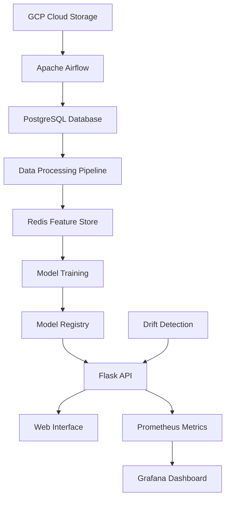

# 🚢 Titanic Survivor MLOps Platform

<div align="center">


**A Production-Ready Machine Learning Operations Platform for Titanic Survival Prediction**

*Combining cutting-edge MLOps practices with the classic Titanic dataset to create a complete end-to-end ML pipeline*

</div>

---

## 🌟 Overview

Welcome to the **Titanic Survivor MLOps Platform** - a comprehensive machine learning operations system that demonstrates best practices in modern ML engineering. This project takes the classic Titanic survival prediction problem and transforms it into a production-ready MLOps pipeline with automated data ingestion, feature engineering, model training, deployment, monitoring, and drift detection.

### 🎯 What Makes This Special?

- **🔄 Complete MLOps Pipeline**: From data ingestion to model monitoring
- **🚀 Production-Ready**: Containerized services with monitoring and logging
- **📊 Real-time Monitoring**: Prometheus metrics and Grafana dashboards
- **🔍 Drift Detection**: Advanced statistical drift detection using Alibi Detect
- **💾 Feature Store**: Redis-based feature store for efficient data serving
- **🌊 Orchestration**: Apache Airflow for workflow management
- **🎨 Interactive UI**: Beautiful web interface for predictions
- **📈 Scalable Architecture**: Microservices-based design

---

## 🏗️ Architecture



### 🧩 Core Components

| Component | Technology | Purpose |
|-----------|------------|---------|
| **Data Orchestration** | Apache Airflow | Workflow management and scheduling |
| **Data Storage** | PostgreSQL | Primary data warehouse |
| **Feature Store** | Redis | Real-time feature serving |
| **Model Training** | Scikit-learn | ML model development |
| **API Service** | Flask | Model serving and predictions |
| **Monitoring** | Prometheus + Grafana | Metrics and visualization |
| **Drift Detection** | Alibi Detect | Data drift monitoring |
| **Containerization** | Docker | Service isolation and deployment |

---

## 🚀 Quick Start

### Prerequisites

Before you begin, ensure you have the following installed:

- 🐍 **Python 3.11+**
- 🐳 **Docker & Docker Compose**
- 🔴 **Redis Server**
- 🐘 **PostgreSQL**
- ☁️ **Google Cloud SDK** (for GCP integration)

### 🛠️ Installation

#### 1. Clone the Repository

```bash
git clone https://github.com/your-username/Titanic-Survivor-MLOPS.git
cd Titanic-Survivor-MLOPS
```

#### 2. Set Up Python Environment

```bash
# Create virtual environment
python -m venv venv

# Activate environment
source venv/bin/activate  # Linux/Mac
# or
venv\Scripts\activate     # Windows

# Install dependencies
pip install -r requirements.txt
```

#### 3. Configure Environment

Create environment configuration files:

```bash
# Create .env file
cat > .env << EOF
DATABASE_HOST=localhost
DATABASE_PORT=5432
DATABASE_NAME=postgres
DATABASE_USER=postgres
DATABASE_PASSWORD=postgres
REDIS_HOST=localhost
REDIS_PORT=6379
FLASK_PORT=5000
EOF
```

#### 4. Start Infrastructure Services

```bash
# Start monitoring stack
docker-compose up -d

# Start Redis (if not using Docker)
redis-server

# Start PostgreSQL (if not using Docker)
# Configure according to your system
```

#### 5. Initialize Database

```bash
# Create database and load initial data
python -c "
from src.data_ingestion import DataIngestion
from config.database_config import DB_CONFIG
from config.paths_config import RAW_DIR

ingestion = DataIngestion(DB_CONFIG, RAW_DIR)
ingestion.run()
"
```

#### 6. Run the Training Pipeline

```bash
# Execute complete training pipeline
python pipeline/training_pipeline.py
```

#### 7. Start the Application

```bash
# Start Flask application
python app.py
```

🎉 **Congratulations!** Your Titanic MLOps platform is now running!

---

## 📖 Detailed Setup Guide

### 🔧 Service Configuration

#### Apache Airflow Setup

1. **Initialize Airflow Database**:
```bash
# Set Airflow home
export AIRFLOW_HOME=$(pwd)

# Initialize database
airflow db init

# Create admin user
airflow users create \
    --username admin \
    --firstname Admin \
    --lastname User \
    --role Admin \
    --email admin@example.com \
    --password admin
```

2. **Start Airflow Services**:
```bash
# Start webserver
airflow webserver --port 8080 &

# Start scheduler
airflow scheduler &
```

#### Database Configuration

1. **PostgreSQL Setup**:
```sql
-- Connect to PostgreSQL and create database
CREATE DATABASE titanic_mlops;

-- Create user
CREATE USER mlops_user WITH PASSWORD 'secure_password';
GRANT ALL PRIVILEGES ON DATABASE titanic_mlops TO mlops_user;
```

2. **Update Configuration**:
```python
# config/database_config.py
DB_CONFIG = {
    'host': 'your_host',
    'port': '5432',
    'dbname': 'titanic_mlops',
    'user': 'mlops_user',
    'password': 'secure_password'
}
```

#### Google Cloud Platform Setup

1. **Create GCP Project**:
   - Go to [Google Cloud Console](https://console.cloud.google.com/)
   - Create a new project
   - Enable Cloud Storage API

2. **Create Service Account**:
   - Go to IAM & Admin → Service Accounts
   - Create new service account
   - Download JSON key file
   - Place in `include/titanic_key_gcp.json`

3. **Create Storage Bucket**:
```bash
# Create bucket for data storage
gsutil mb gs://your-titanic-data-bucket

# Upload data
gsutil cp data/Titanic-Dataset.csv gs://your-titanic-data-bucket/
```

---

## 🎮 Usage Guide

### 🌐 Web Interface

1. **Access the Application**:
   - Open browser to `http://localhost:5000`
   - Fill in passenger details
   - Get survival prediction with confidence score

2. **Available Endpoints**:
   - `GET /` - Main prediction interface
   - `POST /predict` - API endpoint for predictions
   - `GET /metrics` - Prometheus metrics
   - `GET /health` - Health check

### 📊 Monitoring & Dashboards

1. **Prometheus Metrics** (`http://localhost:9090`):
   - Prediction counts
   - Response times
   - Drift detection alerts
   - System health metrics

2. **Grafana Dashboard** (`http://localhost:3000`):
   - Username: `admin`
   - Password: `admin`
   - Pre-configured ML monitoring dashboard

### 🔍 Data Drift Detection

The platform includes automatic drift detection:

```python
# Monitor for data drift
from alibi_detect.cd import KSDrift

# Automatic drift detection on new predictions
# Alerts sent to monitoring system when drift detected
```

---

## 🏃‍♂️ Running Workflows

### 📋 Training Pipeline

Execute the complete ML pipeline:

```bash
# Full pipeline execution
python pipeline/training_pipeline.py
```

**Pipeline Steps**:
1. **Data Ingestion**: Extract from PostgreSQL
2. **Data Processing**: Clean, engineer features
3. **Feature Storage**: Store in Redis
4. **Model Training**: Train with hyperparameter tuning
5. **Model Evaluation**: Validate performance
6. **Model Registration**: Save trained model

### 🔄 Airflow DAGs

1. **Data Extraction DAG** (`extract_data_from_gcp`):
   - Downloads data from GCP Storage
   - Loads into PostgreSQL
   - Triggers processing pipeline

2. **Training DAG** (can be extended):
   - Scheduled model retraining
   - Performance monitoring
   - Model deployment

### 🧪 API Testing

Test the prediction API:

```bash
# Test prediction endpoint
curl -X POST http://localhost:5000/predict \
  -H "Content-Type: application/json" \
  -d '{
    "Name": "John Doe",
    "Age": 30,
    "Sex": "male",
    "Pclass": 3,
    "SibSp": 0,
    "Parch": 0,
    "Fare": 7.25,
    "Embarked": "S",
    "Cabin": ""
  }'
```

---

## 📁 Project Structure

```
📦 Titanic-Survivor-MLOPS/
├── 🗂️ artifacts/                 # Model artifacts and data
│   ├── models/                   # Trained models
│   └── raw/                      # Raw datasets
├── ⚙️ config/                     # Configuration files
│   ├── database_config.py        # Database settings
│   └── paths_config.py           # File paths
├── 🌊 dags/                       # Airflow DAGs
│   ├── exampledag.py
│   └── extract_data_from_gcp.py
├── 🔧 src/                        # Source code
│   ├── data_ingestion.py         # Data extraction logic
│   ├── data_processing.py        # Feature engineering
│   ├── feature_store.py          # Redis feature store
│   ├── model_training.py         # ML training pipeline
│   ├── logger.py                 # Logging utilities
│   └── custom_exception.py       # Error handling
├── 🚀 pipeline/                   # ML pipelines
│   └── training_pipeline.py      # Complete training flow
├── 🎨 templates/                  # Web UI templates
│   └── index.html
├── 🎯 static/                     # Static assets
│   └── style.css
├── 🐳 docker-compose.yml          # Container orchestration
├── 📊 prometheus.yml              # Monitoring config
├── 🌐 app.py                      # Flask application
└── 📋 requirements.txt            # Python dependencies
```

---

## 🔧 Configuration

### Environment Variables

Create a `.env` file with the following variables:

```bash
# Database Configuration
DATABASE_HOST=localhost
DATABASE_PORT=5432
DATABASE_NAME=postgres
DATABASE_USER=postgres
DATABASE_PASSWORD=postgres

# Redis Configuration
REDIS_HOST=localhost
REDIS_PORT=6379
REDIS_DB=0

# Application Configuration
FLASK_PORT=5000
FLASK_DEBUG=False

# Monitoring
PROMETHEUS_PORT=9090
GRAFANA_PORT=3000

# GCP Configuration
GOOGLE_APPLICATION_CREDENTIALS=include/titanic_key_gcp.json
GCP_BUCKET_NAME=your-bucket-name
```

### Airflow Configuration

```python
# airflow_settings.yaml
airflow:
  connections:
    - conn_id: postgres_default
      conn_type: postgres
      conn_host: localhost
      conn_schema: postgres
      conn_login: postgres
      conn_password: postgres
      conn_port: 5432
```

---

## 📊 Features & Capabilities

### 🤖 Machine Learning Features

- **Advanced Feature Engineering**: Title extraction, family size, fare per class
- **Data Balancing**: SMOTE for handling class imbalance
- **Hyperparameter Tuning**: RandomizedSearchCV for optimal parameters
- **Model Evaluation**: Comprehensive metrics and validation
- **Drift Detection**: Statistical tests for data distribution changes

### 🔄 MLOps Features

- **Automated Pipelines**: End-to-end automation with Airflow
- **Feature Store**: Redis-based feature serving for low latency
- **Model Registry**: Versioned model storage
- **Monitoring**: Prometheus metrics and Grafana dashboards
- **Logging**: Structured logging throughout the pipeline
- **Error Handling**: Comprehensive exception management

### 🌐 Production Features

- **Containerization**: Docker containers for all services
- **Load Balancing**: Ready for horizontal scaling
- **Health Checks**: Endpoint monitoring
- **Graceful Degradation**: Fallback mechanisms
- **Security**: Input validation and sanitization

---

## 🧪 Testing

### Unit Tests

```bash
# Run unit tests
python -m pytest tests/ -v

# Run with coverage
python -m pytest tests/ --cov=src --cov-report=html
```

### Integration Tests

```bash
# Test DAGs
python -m pytest tests/dags/ -v

# Test API endpoints
python -m pytest tests/api/ -v
```

### Load Testing

```bash
# Install locust for load testing
pip install locust

# Run load tests
locust -f tests/load_test.py --host=http://localhost:5000
```

---

## 📈 Monitoring & Observability

### Metrics Collected

- **Application Metrics**:
  - Prediction request count
  - Response times
  - Error rates
  - Model accuracy

- **Infrastructure Metrics**:
  - CPU and memory usage
  - Database connections
  - Redis operations
  - Container health

### Alerting Rules

Configure alerts for:
- High error rates (>5%)
- Slow response times (>2s)
- Data drift detection
- Model performance degradation

---

## 🚀 Deployment

### Local Development

```bash
# Development mode with hot reload
export FLASK_ENV=development
python app.py
```

### Production Deployment

1. **Docker Deployment**:
```bash
# Build and deploy with Docker Compose
docker-compose -f docker-compose.prod.yml up -d
```

2. **Kubernetes Deployment**:
```bash
# Apply Kubernetes manifests
kubectl apply -f k8s/
```

3. **Cloud Deployment**:
   - Google Cloud Run
   - AWS ECS/Fargate
   - Azure Container Instances

---

## 🤝 Contributing

We welcome contributions! Here's how to get started:

### Development Setup

1. **Fork the repository**
2. **Create feature branch**: `git checkout -b feature/amazing-feature`
3. **Make changes and test thoroughly**
4. **Commit changes**: `git commit -m 'Add amazing feature'`
5. **Push to branch**: `git push origin feature/amazing-feature`
6. **Open a Pull Request**

### Contribution Guidelines

- Follow PEP 8 style guide
- Add tests for new features
- Update documentation
- Ensure all tests pass
- Add detailed commit messages

---

## 📚 Additional Resources

### Learning Materials

- 📖 [MLOps Best Practices](https://ml-ops.org/)
- 🎓 [Apache Airflow Documentation](https://airflow.apache.org/docs/)
- 🔍 [Prometheus Monitoring Guide](https://prometheus.io/docs/)
- 🎨 [Flask Web Development](https://flask.palletsprojects.com/)

### Related Projects

- [MLflow for Experiment Tracking](https://mlflow.org/)
- [Kubeflow for Kubernetes MLOps](https://kubeflow.org/)
- [DVC for Data Version Control](https://dvc.org/)

---

## 🐛 Troubleshooting

### Common Issues

#### Database Connection Errors
```bash
# Check PostgreSQL status
sudo systemctl status postgresql

# Restart PostgreSQL
sudo systemctl restart postgresql

# Check connection
psql -h localhost -U postgres -d postgres
```

#### Redis Connection Issues
```bash
# Start Redis server
redis-server

# Test connection
redis-cli ping
```

#### Docker Issues
```bash
# Clean up containers
docker-compose down
docker system prune -f

# Rebuild images
docker-compose build --no-cache
```

#### Port Conflicts
```bash
# Check port usage
sudo netstat -tulpn | grep :5000

# Kill process using port
sudo kill -9 $(sudo lsof -t -i:5000)
```

### Logs and Debugging

```bash
# View application logs
tail -f logs/log_$(date +%Y-%m-%d).log

# View Airflow logs
tail -f ~/airflow/logs/scheduler/latest/*.log

# View Docker logs
docker-compose logs -f flask_app
```

---

## 📄 License

This project is licensed under the MIT License - see the [LICENSE](LICENSE) file for details.

---

## 🙏 Acknowledgments

- **Kaggle** for the Titanic dataset
- **Open Source Community** for amazing tools and libraries
- **MLOps Community** for best practices and patterns

---

<div align="center">

### 🌟 Star this repository if you found it helpful!

**Made with ❤️ and lots of ☕**

*Happy MLOps Engineering! 🚀*

</div>